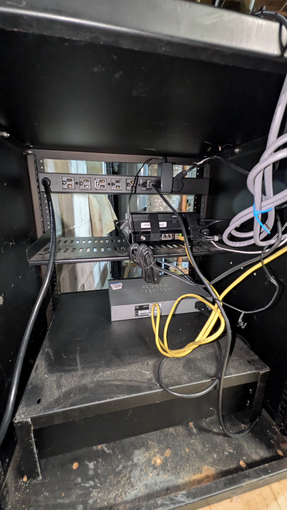

# Home Network Security Lab

**Production state documented:** 2026-06-20  
**Visibility:** Public-safe — sensitive host IPs/MACs live in private [NetBox Cloud](https://arfv7221.cloud.netboxapp.com/) only.

Segmented home lab transitioning from consumer networking to VLAN-isolated, privacy-focused infrastructure. Part of the broader [Privacy Migration](https://github.com/users/jacob-kraniak/projects/1) program.

## Current Topology (summary)

```
ISP ONT → ER605-Gateway (VLAN tagging) → OpenWRT-AP (subinterfaces)
                                              ↓
                                    TL-SG116E Switch → clients / APs
```

| Layer | Device | Role |
|-------|--------|------|
| Gateway | ER605-Gateway | Omada primary router; VLAN 1/10/20 tagging on LAN trunk |
| Distribution | OpenWRT-AP | `br-lan.1`, `br-lan.10` (IoT), `br-lan.20` (Guest) subinterfaces |
| Switching | TL-SG116E-SWITCH-1 | Basement rack switch; patch panel 1:1 mapping |
| Wireless | K108_WAP2_Office | EAP225 Omada office AP (uplink via ER605 LAN segment) |
| Workstation | BazzitePC | Primary daily driver / lab host |

**WiFi SSIDs:** `K108-Home-Secure` (VLAN 1), `K108-Home-IoT` (VLAN 10), `K108-Guest` (VLAN 20)

See [docs/network-overview.md](docs/network-overview.md) for VLAN/prefix mapping and redaction policy.

## Web Portals

| Portal | Purpose |
|--------|---------|
| [NetBox Cloud](https://arfv7221.cloud.netboxapp.com/) | Authoritative CMDB / IPAM (~52 devices) |
| [Omada Cloud](https://use1-omada-cloud.tplinkcloud.com/) | ER605 / EAP management |

## Project Status

- **Phase 1** — Rack + NetBox bootstrap: complete
- **Phase 1.5** — ER605 cutover + VLAN segmentation: complete (2026-06-20)
- **NetBox documentation** — production inventory synced: complete
- **Next:** Proxmox/Wazuh integration, automated NetBox sync, public topology diagrams

## Quick Links

- [Network Overview](docs/network-overview.md)
- [NetBox Inventory Progress](docs/NetBox-Inventory-Progress.md)
- [Post-Cutover Stabilization](docs/Post-Cutover-Network-Stabilization-and-Provisioning.md)
- [Devices Summary](docs/inventory/devices-summary.md)
- [Roadmap](docs/ROADMAP.md)
- [Phase 1 Completion](docs/phases/phase-1-completion.md)
- [Automation repo](https://github.com/jacob-kraniak/netbox-nmap-scan)

## Rack Photos (Phase 1)



